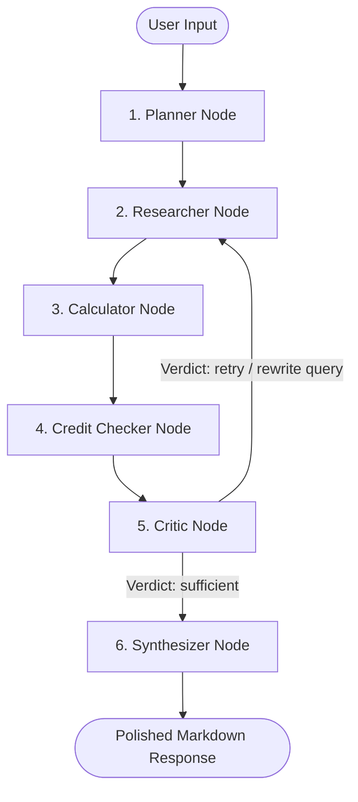

# AI-Powered Loan Advisory Agent

A local, production-grade Multi-Agent RAG (Retrieval-Augmented Generation) system built entirely from scratch—from raw banking policy document collection and text preprocessing to vector space indexing, state-machine orchestration, and interactive web dashboard execution.

---

## Architectural Workflow

The application operates as a stateful multi-agent system orchestrated using **LangGraph**. Below is the flow of execution for a single user query:



### Agent Node Breakdown

* **Planner:** Evaluates the user input against the conversation history and updates the user profile. Determines which capabilities (database search, math calculation, credit score checking) are needed and extracts parameters.
* **Researcher:** Executes vector database searches over internal policy documents.
* **Calculator:** Performs mathematical calculations (monthly EMI and yearly amortization schedules) deterministically.
* **Credit Checker:** Simulated credit checking agent to simulate financial profile ratings.
* **Critic:** Evaluates if the research evidence is sufficient and on-topic. If not, it rewrites the query and triggers a retry loop (capped at a maximum of 2 retries).
* **Synthesizer:** Formulates a clear, professional, and formatted response grounded strictly in the gathered evidence.

---

## Core Technical Features

* **End-to-End Ingestion Pipeline:** Custom text processing script that parses raw banking PDFs, cleans layouts, and extracts structured text.
* **Vector Indexing & Retrieval:** Text splits are indexed into a local ChromaDB database utilizing `Nomic-Embed-Text` embeddings. Search query retrieval is configured with $k=5$ for comprehensive context matching.
* **Stateful Conversation Memory:** Uses a persistent SQLite checkpointer (`SqliteSaver`) to maintain chat states, user profiles, and conversation threads across app updates and server restarts.
* **Robust JSON Guardrails:** Integrates custom fallback parsing to intercept and format raw JSON output structures produced by local LLMs, mapping them directly to LangGraph execution blocks.
* **Deterministic Mathematical Engine:** Calculates loan interest and principal schedules programmatically, avoiding LLM hallucinations for amortization statistics.

---

## Technical Specifications

| Component | Choice | Configuration |
| :--- | :--- | :--- |
| **Orchestrator** | LangGraph / LangChain | Multi-agent state graph with SQLite persistence |
| **Language Model** | Qwen-2.5-Coder:7b | Local execution via Ollama (Temperature = 0) |
| **Embeddings** | Nomic-Embed-Text | Local embedding model via Ollama |
| **Vector DB** | ChromaDB | Local file-system vector store ($k=5$) |
| **Frontend** | Streamlit | Chat interface with live execution traces and interactive charts |

---

## Getting Started

### 1. Model Setup
Install Ollama and pull the models locally:
```bash
# Pull the reasoning engine
ollama pull qwen2.5-coder:7b

# Pull the embedding engine
ollama pull nomic-embed-text:latest
```

### 2. Environment Setup
Set up the Python virtual environment and install the required dependencies:
```bash
# Create and activate virtual environment
python3 -m venv venv
source venv/bin/activate

# Install requirements
pip install -r requirements.txt
```

### 3. Pipeline Ingestion (From Raw Data to Vector DB)
1. Place raw banking policy PDFs in `data/raw_pdfs/`.
2. Extract text from the PDFs:
   ```bash
   python src/ingestion/pdf_extractor.py
   ```
3. Index the texts into the vector database:
   ```bash
   python src/ingestion/vector_builder.py
   ```

---

## Execution

### CLI Terminal Interface
Interact with the agent directly inside your terminal session:
```bash
python main.py
```

### Streamlit Web Dashboard
Launch the web interface (to serve the application locally):
```bash
python -m streamlit run src/ui/app.py
```
Open your browser and navigate to the address displayed in the terminal console (typically `http://localhost:8501`).
