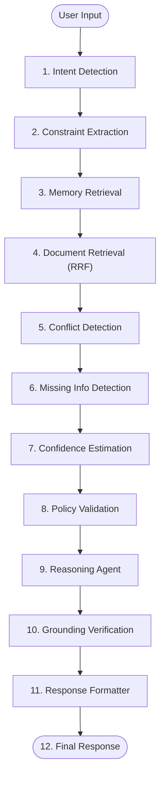

# AI-Powered Loan Advisory Agent

A local, production-grade Multi-Agent RAG (Retrieval-Augmented Generation) system built entirely from scratch—from raw banking policy document collection and text preprocessing to vector space indexing, state-machine orchestration, and interactive web dashboard execution.

---

## Architectural Workflow

The application operates as a stateful multi-agent system orchestrated using **LangGraph**. Below is the flow of execution for a single user query:


```mermaid
graph TD
    Start(["User Input"]) --> Intent["1. Intent Detection"]
    Intent --> Constraints["2. Constraint Extraction"]
    Constraints --> Memory["3. Memory Retrieval"]
    Memory --> Retrieve["4. Document Retrieval (RRF)"]
    Retrieve --> Conflicts["5. Conflict Detection"]
    Conflicts --> MissingInfo["6. Missing Info Detection"]
    MissingInfo --> Confidence["7. Confidence Estimation"]
    Confidence --> Policy["8. Policy Validation"]
    Policy --> Reasoning["9. Reasoning Agent"]
    Reasoning --> Grounding["10. Grounding Verification"]
    Grounding --> Formatter["11. Response Formatter"]
    Formatter --> End(["12. Final Response"])
```

### Core Architectural Advancements

* **Strict Pydantic Payloads:** The pipeline replaces unstructured dictionary states with strictly typed `pydantic.BaseModel` objects across all 12 sequential nodes, providing strong guarantees against downstream state corruption.
* **Evidence-First Retrieval:** Retrieves documents using parallel queries merged via **Reciprocal Rank Fusion (RRF)**. Each chunk retains explicit metadata (`Source`, `Retrieval Score`, `Timestamp`, `Trust Score`).
* **Deterministic Numeric Engine:** The LLM is firewalled from doing mental math. All LTV validations, APR comparisons, date manipulation, and compound interest calculations are offloaded to a zero-dependency Python utility (`numeric_utils.py`).
* **Adversarial Hallucination Guard:** The penultimate graph node acts as a factual editor, verifying that every generated sentence can be explicitly traced back to the retrieved chunks or deterministic tool outputs.
* **Missing Information Detection:** Employs a cross-domain utility to gracefully refuse requests if required variables (e.g., remaining tenure) are omitted, rather than hallucinating inputs.

---

## Core Technical Features

* **End-to-End Ingestion Pipeline:** Custom text processing script that parses raw banking PDFs, cleans layouts, and extracts structured text.
* **Vector Indexing & Retrieval:** Text splits are indexed into a local ChromaDB database utilizing `Nomic-Embed-Text` embeddings. Search query retrieval is configured with $k=5$ for comprehensive context matching.
* **JWT Authentication & Multi-Tenancy:** Secure session handling utilizing `bcrypt` hashing, sliding-window rate limiting, and JWT tokens to scope threads natively per-user.
* **Managed Vector DB & RRF:** Configurable fallback between local ChromaDB and managed high-availability **Pinecone** clusters.
* **Production Persistence (PostgreSQL):** Uses `PostgresSaver` for concurrent multi-user checkpointer capabilities.
* **Cost & Observability:** Implements custom JSON-structured logging and real-time telemetry metrics (`Tokens`, `Latency`, `Est. LLM Cost`).

---

## Technical Specifications

| Component | Choice | Configuration |
| :--- | :--- | :--- |
| **Orchestrator** | LangGraph | 12-Stage Pipeline with Pydantic state |
| **Language Model** | OpenAI / Bedrock / Ollama | Dynamically configurable via UI |
| **Vector DB** | Pinecone / ChromaDB | RRF-enabled retrieval ($k=5$) |
| **Database** | PostgreSQL | Persistent multi-tenant state checkpointer |
| **Frontend** | Streamlit | Integrated auth, cost tracking, & interactive UI |

---

## Getting Started

### 1. Model Setup
Install Ollama and pull the models locally:
```bash
# Pull the reasoning engine
ollama pull qwen2.5-coder:7b

# Pull the embedding engine
ollama pull nomic-embed-text:latest
```

### 2. Environment Setup
Set up the Python virtual environment and install the required dependencies:
```bash
# Create and activate virtual environment
python3 -m venv venv
source venv/bin/activate

# Install requirements
pip install -r requirements.txt
```

### 3. Pipeline Ingestion (From Raw Data to Vector DB)
1. Place raw banking policy PDFs in `data/raw_pdfs/`.
2. Extract text from the PDFs:
   ```bash
   python src/ingestion/pdf_extractor.py
   ```
3. Index the texts into the vector database:
   ```bash
   python src/ingestion/vector_builder.py
   ```

---

## Production Deployment (Docker)

To deploy the production-ready application stack (Agent UI + PostgreSQL), use Docker Compose:

```bash
# Provide necessary environment variables in .env
docker-compose up --build -d
```
The application will automatically apply health checks to the Postgres database and spin up on port `8501`.

## Local Development Execution

If running locally without Docker:
```bash
python -m streamlit run src/ui/app.py
```

## Running the Test Suite
The repository includes a comprehensive set of adversarial tests to verify the pipeline's robustness against hallucinations, contradictions, missing variables, and mathematical impossibilities:
```bash
pytest tests/test_agent_robustness.py
pytest tests/test_pipeline_refactor.py
```
