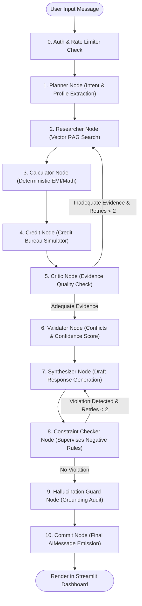

# Technical Presentation & Academic Defense: AI-Powered Loan Advisory Agent

**Target Audience:** Software Engineering / AI Systems Academic Reviewer & Teacher  
**Presenter Level:** Senior AI / Systems Engineer  
**System Architecture:** Stateful Multi-Agent Orchestration with Guardrails, Deterministic Execution, & Hybrid RAG  

---

## 1. Executive Summary & Architectural Overview

The **AI-Powered Loan Advisory Agent** is a domain-specific, stateful multi-agent artificial intelligence system designed to provide financial, policy, and eligibility advice for banking customers. Unlike traditional single-prompt chatbot architectures that suffer from mathematical hallucinations, ungrounded policy generation, and context drift, this system is engineered as a **Directed Cyclic Graph (DCG) state machine** powered by **LangGraph** and strictly typed **Pydantic v2 data schemas**.

### Core Engineering Innovations
1. **Mathematical Isolation (Firewalled Math):** The Large Language Model (LLM) is completely isolated from doing mental arithmetic. Financial formulas (EMI, LTV, compound interest, timeline arithmetic) are handled by a zero-dependency deterministic Python engine (`numeric_utils.py`).
2. **Multi-Agent Verification Pipeline:** A 10-to-12 stage sequential execution pipeline featuring explicit separation of concerns: *Planning*, *Information Retrieval*, *Evidence Classification*, *Adequacy Critique*, *Constraint Validation*, *Synthesis*, *Constraint Checking*, and *Adversarial Hallucination Guarding*.
3. **Evidence-First Retrieval-Augmented Generation (RAG):** Multi-query vector retrieval merged via **Reciprocal Rank Fusion (RRF)** with explicit metadata provenance tracking (`Source`, `Document ID`, `Retrieval Score`, `Trust Score`, `Timestamp`).
4. **Resilience & Distributed Telemetry:** Production-grade fault-tolerance using the **Circuit Breaker** design pattern, exponential backoff retries with jitter, JSON-structured logging, and real-time metric tracing (p50/p95 latency, token usage, cost tracking).
5. **Multi-Tenant State Checkpointing:** Persistent session management isolated by JWT auth and backed by SQLite or high-concurrency **PostgreSQL** (`PostgresSaver`).

---

## 2. Technical Stack Specifications

| Layer | System Component | Technology / Library | Architectural Role |
| :--- | :--- | :--- | :--- |
| **Orchestration** | Graph Engine | `LangGraph` (`StateGraph`) | Manages node transitions, conditional routing, and state persistence |
| **Data Validation** | Schema Enforcement | `Pydantic v2` (`BaseModel`) | Enforces structured LLM JSON outputs and inter-node type safety |
| **Language Models** | Reasoning Engines | `Qwen2.5-Coder:7b` / `Gemma 4` / `GPT-4o-mini` | Dynamically switched via `llm_factory.py` (Ollama / OpenAI / Bedrock) |
| **Vector DB** | Knowledge Index | `ChromaDB` / `Pinecone` | Vector similarity indexing using `nomic-embed-text` embeddings ($k=5$) |
| **Math Engine** | Financial Tooling | Python `math`, `dateutil.relativedelta` | Deterministic EMI, LTV, compound interest, and amortization schedule generation |
| **Persistence** | Checkpointer | `SqliteSaver` / `PostgresSaver` | Multi-tenant session state preservation across user turns |
| **Security & Auth** | API Security | `JWT` (HS256), `bcrypt`, SQLite | Thread-scoped session isolation & sliding-window rate limiting |
| **Observability** | Telemetry Tracing | Custom JSON Logger, `Tracer`, `MetricsExporter` | Latency breakdown (avg/p50/p95), token usage counter, and USD cost tracking |
| **User Interface** | Web Dashboard | `Streamlit` | Interactive multi-turn chat, live node execution visualizer, & data charts |

---

## 3. High-Level System Architecture & Flow

### Multi-Agent State Machine Workflow



---

## 4. In-Depth Subsystem Technical Analysis

### A. State Schema Design & Isolation (`state.py` & `pipeline_state.py`)
To prevent **cross-turn state pollution** while maintaining long-term memory (e.g. user profile attributes), the system categorizes state variables into two domains:

```python
class AgentState(TypedDict):
    # Persistent across turns (checkpointed in DB)
    messages: Annotated[list[BaseMessage], add_messages]
    user_profile: UserProfile          # Merged incrementally by Planner
    user_constraints: list[str]        # Appended dynamically per user request
    uploaded_doc_text: Optional[str]   # Document context loaded into session

    # Scratchpad state (rebuilt strictly on every turn)
    needs_research: bool
    needs_calculation: bool
    needs_credit_check: bool
    search_query: str
    calc_params: Optional[dict]
    research_evidence: str
    calculation_result: str
    credit_result: str
    validation_result: dict
    draft_response: str
    constraint_feedback: str
    confidence_score: float
    confidence_reasoning: list[str]
    critic_verdict: Literal["sufficient", "retry"]
    retry_count: int
    constraint_retry_count: int
```

> **Engineering Highlight:** The **Pipeline Refactor** (`pipeline_state.py` & `pipeline_graph.py`) takes this a step further by replacing raw dictionaries with strictly typed Pydantic payloads (`IntentData`, `ConstraintData`, `DocumentData`, `ConfidenceData`, `PolicyValidationData`), ensuring zero runtime `KeyError` exceptions across graph node edges.

---

### B. Multi-Source Evidence Retrieval & Reciprocal Rank Fusion (RRF) (`retriever.py`)
Standard vector retrieval often suffers from semantic drift when searching numerical rules or dense policy text. The RAG subsystem addresses this using:

1. **Reciprocal Rank Fusion (RRF):** Merges multi-query document sets by calculating rank decay scores:
   $$RRF\_Score(d \in D) = \sum_{m \in M} \frac{1}{k + r_m(d)}$$
   where $k=60$ is the smoothing constant, and $r_m(d)$ is the rank of document $d$ in result list $m$.

2. **Metadata-Enriched Evidence Payload (`EvidenceChunk`):**
   ```json
   {
     "source": "HDFC_Home_Loan_Policy_2024.pdf",
     "document_id": "doc_8492",
     "retrieval_score": 0.0328,
     "trust_score": 0.95,
     "timestamp": "2026-07-30T11:04:15",
     "content": "Minimum entry age for salaried applicant is 21 years..."
   }
   ```

3. **Policy Taxonomy Classifier:** The `researcher_node` parses raw RAG text through a structured classifier prompt, tagging policy statements into three strict tiers:
   - `hard_requirement`: Mandatory constraints (e.g. minimum age $\ge 21$, credit score $\ge 750$).
   - `recommendation`: Highly advised guidelines.
   - `preference`: Non-binding preferences.

---

### C. Deterministic Financial Computation Engine (`numeric_utils.py` & `tools.py`)
Language models are notorious for producing incorrect arithmetic results. To achieve absolute precision:
- **EMI Formula Execution:**
  $$EMI = P \times r \times \frac{(1 + r)^n}{(1 + r)^n - 1}$$
  where $P$ is principal, $r$ is monthly interest rate ($\frac{rate\_pa}{12 \times 100}$), and $n$ is total months.
- **Amortization Breakdown:** Automatically constructs yearly principal vs. interest payment arrays, directly fed to Streamlit `st.line_chart` without text re-parsing.
- **Loan-to-Value (LTV) Guard:** Checks $LTV = \frac{Loan}{Property} \times 100 \le Max\_LTV$.
- **Regex Guardrails (`extract_calc_params`):** If the LLM Planner misses explicit numeric parameters in the query string, regex extractors automatically capture patterns like `$50,000`, `8.5%`, `5 years` or `60 months`.

---

### D. Multi-Tier Verification & Adversarial Hallucination Defense

```
[Retrieved Context & Tools]
           │
           ▼
   ┌─────────────────┐     is_adequate=false & retries < 2
   │   Critic Node   ├───────────────────────────────────────┐
   └────────┬────────┘                                       │
            │ is_adequate=true                               │ Rewritten Query
            ▼                                                ▼
   ┌─────────────────┐                             ┌──────────────────┐
   │ Validator Node  │                             │ Researcher Node  │
   └────────┬────────┘                             └──────────────────┘
            │ confidence >= 0.6
            ▼
   ┌─────────────────┐
   │ Synthesizer Node│
   └────────┬────────┘
            │ Draft Response
            ▼
   ┌─────────────────┐     violated=true & retries < 2
   │ConstraintChecker├───────────────────────────────────────┐
   └────────┬────────┘                                       │ Feedback Re-prompt
            │ violated=false                                 │
            ▼                                                │
   ┌─────────────────┐                                       │
   │HallucinationGuard│◄──────────────────────────────────────┘
   └────────┬────────┘
            │ Verified & Grounded Text
            ▼
   ┌─────────────────┐
   │   Commit Node   │
   └─────────────────┘
```

1. **Critic Node (`critic_node`):** Evaluates if the evidence contains necessary data. If inadequate, it generates a `rewritten_query` and triggers a graph feedback loop back to `researcher_node` (capped at 2 retries).
2. **Validator Node (`validator_node`):** Calculates a normalized **Confidence Score** ($0.0 \le C \le 1.0$) based on doc counts, profile contradictions, missing fields, and timeline mismatches. If $C < 0.6$, the system forces the model to refuse a definitive recommendation.
3. **Constraint Checker (`constraint_checker_node`):** Evaluates the draft against user negative constraints (e.g. *"Do not suggest credit score improvement"*). If violated, sends explicit feedback to `synthesizer_node` for re-drafting.
4. **Hallucination Guard (`hallucination_guard_node`):** The penultimate node performs a line-by-line factual audit. Any statement not traceable to profile, evidence, or tool output is either stripped or re-written to reflect uncertainty.

---

### E. Fault Tolerance & Distributed Observability (`resilience.py` & `observability.py`)

1. **Circuit Breaker Design Pattern:**
   - **CLOSED:** Normal state. LLM requests execute normally.
   - **OPEN:** Triggered after 3 consecutive API timeouts/errors. Bypasses LLM invocations and immediately emits structured system fallbacks.
   - **HALF-OPEN:** Executes a trial call after a 30-second cooldown period to detect service recovery.

2. **Distributed Tracing & Telemetry:**
   - **Structured JSON Logs:** All system events are emitted in JSON format containing ISO timestamps, log levels, execution contexts, and trace IDs.
   - **Trace Spans (`Tracer`):** Decorator `@trace_node` tracks parent-child span IDs, measuring execution latency per node in milliseconds.
   - **Metrics Exporter:** Calculates rolling p50/p95/max node latencies, categorizes runtime errors, aggregates token consumption per model, and triggers alerts if estimated USD costs exceed predefined thresholds ($1.00 USD).

---

## 5. Critical Technical Shortcomings & Trade-Offs

When discussing this project with an engineering reviewer or teacher, presenting a clear understanding of its shortcomings demonstrates engineering maturity. Below are the key architectural trade-offs:

### 1. High Latency Overhead of Multi-Node Graph Traversal
- **Problem:** Because every user query traverses up to 7–10 graph nodes (Planner, Researcher, Calculator, Critic, Validator, Synthesizer, Constraint Checker, Hallucination Guard), a single turn requires multiple sequential LLM inference calls.
- **Impact:** Query latency ranges from **3 to 12 seconds** on cloud models (e.g. GPT-4o-mini) and **15 to 35 seconds** on local 7B models (e.g. Qwen2.5-Coder via Ollama).
- **Engineering Fix:** Implement parallel execution for independent nodes (e.g. executing `researcher`, `calculator`, and `credit` in parallel via LangGraph `async` fan-out).

### 2. Stochastic JSON Generation & Parser Fallbacks
- **Problem:** Smaller local LLMs (7B parameters) occasionally output malformed JSON or wrap JSON inside unauthorized markdown code blocks despite prompt instructions.
- **Impact:** System relies on `validate_llm_json` fallback instances. If parsing fails, the system defaults to safe generic plans (`default_plan`), potentially missing subtle user profile updates.
- **Engineering Fix:** Enforce strict JSON mode / Grammars at the inference server level (e.g. Ollama `format="json"` or llama.cpp GBNF grammar constraints).

### 3. Vector Chunk Granularity & Multi-Document Relational Constraints
- **Problem:** Standard chunking strategies (e.g., 500-token fixed splits) break tabular structures in banking policy PDFs.
- **Impact:** If a policy rule requires combining criteria from Page 2 (Income Tier) and Page 10 (Interest Rate Table), standard vector similarity search may retrieve Page 2 while missing Page 10.
- **Engineering Fix:** Implement Parent-Document Retriever or Knowledge Graph RAG (GraphRAG) using entity-relationship indexing.

### 4. Hybrid Search RRF Realization Limitations
- **Problem:** In `retriever.py`, the current RRF implementation simulates multi-source retrieval by querying ChromaDB twice (full query vs keyword string) rather than maintaining a dedicated sparse BM25 engine (e.g., Elasticsearch / Anserini) alongside dense vector search.
- **Impact:** True lexical keyword matching (e.g., exact policy code numbers like `POL-2024-89A`) can be missed if semantic similarity dominates.

### 5. SQLite Checkpointer Concurrency Bottlenecks
- **Problem:** The default `SqliteSaver` checkpointer locks the entire database file during writes (`database is locked`).
- **Impact:** Under high multi-user concurrent traffic, request threads block each other during state snapshot persistence.
- **Engineering Fix:** Production configuration requires switching to the included `PostgresSaver` backed by connection pooling (`psycopg_pool`).

---

## 6. Teacher Presentation Strategy & Defense Guide

### Recommended 10-Minute Presentation Script

1. **Introduction (1 Min):**
   > *"Teacher, today I am presenting an AI-Powered Loan Advisory System designed to solve the critical flaws of general-purpose LLMs in banking: hallucinations, math errors, and unverified policy advice."*

2. **Architecture & State Machine (3 Mins):**
   > *"Instead of a single prompt, we built a 10-stage state machine using LangGraph. Inter-node communication is governed by strictly typed Pydantic models. We enforce complete separation between reasoning and math—all interest rate calculations, EMI computations, and timeline arithmetic are offloaded to a deterministic Python engine."*

3. **Hallucination Prevention & Verification (3 Mins):**
   > *"We implemented a defense-in-depth verification pipeline. The Critic checks if vector-retrieved evidence is adequate. The Validator evaluates candidate response confidence (0.0 to 1.0). The Constraint Checker verifies user-defined negative rules. Finally, an adversarial Hallucination Guard performs line-by-line factual grounding before committing the output."*

4. **Fault Tolerance, Telemetry & Shortcomings (3 Mins):**
   > *"For production reliability, we implemented Circuit Breaker patterns, rate limiting, and real-time p95 latency tracking. The key shortcoming we identified is sequential LLM latency overhead (3-12s turn times), which can be optimized in future work through async parallel node fan-out and local model GBNF grammar enforcement."*

---

## 7. Anticipated Technical Q&A for Academic Defense

**Q1: Why use LangGraph instead of standard LangChain chains or AutoGen?**  
*Answer:* Standard chains are linear and struggle with cyclic loops (like re-querying vector DB when evidence is poor). AutoGen agents communicate via natural text, making deterministic state management difficult. LangGraph gives us precise control over a cyclic state machine where transitions can be conditioned on structured Pydantic boolean flags.

**Q2: How do you guarantee the LLM won't hallucinate financial calculations?**  
*Answer:* The LLM is never allowed to calculate numbers. The `planner_node` uses regex extractors and structured schemas to parse parameters (`principal`, `rate_pa`, `tenure_months`). These parameters are passed to `calculate_emi.func()`, which executes standard float formulas in standard Python.

**Q3: How do you prevent thread state bleeding between different users?**  
*Answer:* Multi-tenancy is enforced at two levels: Authentication (JWT token with bcrypt password hashing) and Checkpointing (`thread_id` prefixes scoped by `{username}_{uuid}`). `list_thread_ids` filters SQLite/Postgres checkpoints strictly by user key prefix.

**Q4: What happens if the local LLM fails or times out?**  
*Answer:* The system is wrapped with a custom `CircuitBreaker`. After 3 consecutive failures, the circuit transitions to `OPEN`, bypassing further API calls and immediately returning structured fallback notices to prevent cascading UI freezes.
